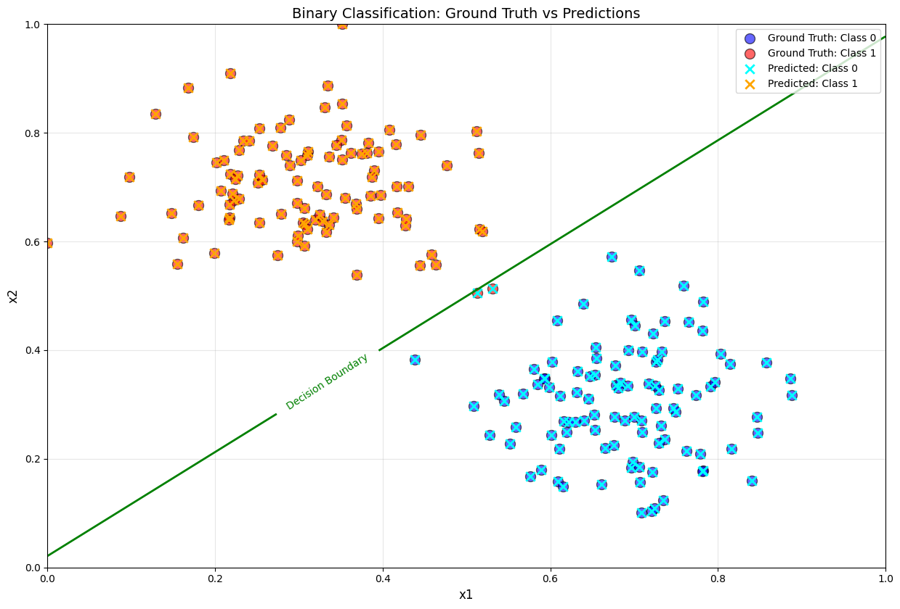
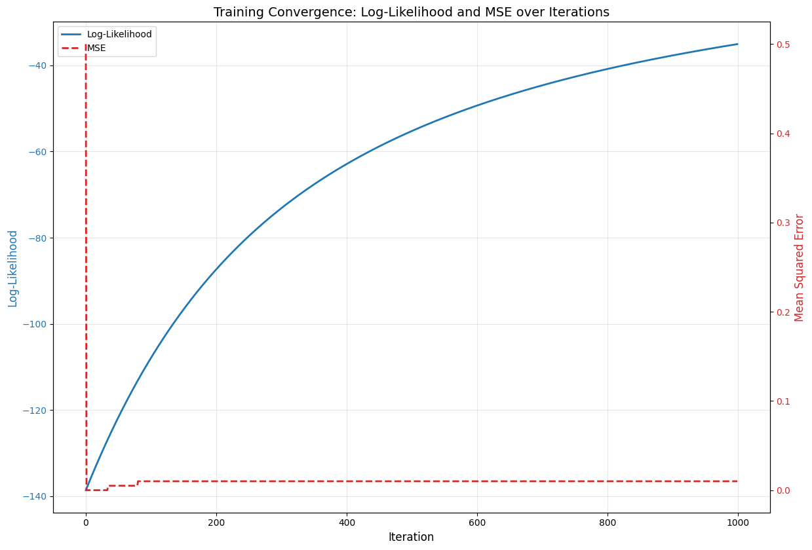

# Sigmoid Binary Classification System

A Python-based machine learning system that generates synthetic 2D data and uses logistic regression with sigmoid activation for binary classification. The system provides comprehensive analysis and visualization of classification performance.

## Features

- **Synthetic Data Generation**: Creates two distinct, configurable Gaussian clusters
- **Logistic Regression**: Custom gradient descent implementation with iteration tracking
- **Classification Visualization**: 2D scatter plot with ground truth, predictions, and decision boundary
- **Training Convergence**: Dual-axis visualization of log-likelihood and MSE progression
- **Statistical Analysis**: Comprehensive markdown report with model metrics and insights
- **Fully Automated**: Single command execution with progress messages

## Installation

### Prerequisites

- Python 3.8 or higher
- UV package manager

### Setup Steps

#### Quick Setup (Automated - All Platforms)

**On Windows (PowerShell):**
```powershell
.\setup.ps1
```

**On Linux/macOS:**
```bash
bash setup.sh
```

These scripts automatically:
- ✓ Checks for UV installation
- ✓ Creates virtual environment with `uv venv`
- ✓ Activates the environment
- ✓ Installs all dependencies from `requirements.txt`

Then just run: `python main.py`

#### Manual Setup (All Platforms - Step by Step)

1. **Install UV** (if not already installed):
   ```bash
   pip install uv
   ```

2. **Create virtual environment**:
   ```bash
   uv venv
   ```
   This works the same on all platforms (Windows, macOS, Linux)

3. **Activate virtual environment**:

   **On Linux/macOS:**
   ```bash
   source .venv/bin/activate
   ```

   **On Windows (Command Prompt):**
   ```cmd
   .venv\Scripts\activate
   ```

   **On Windows (PowerShell):**
   ```powershell
   & .\.venv\Scripts\Activate.ps1
   ```
   *If this fails, try with full path:*
   ```powershell
   & "$PWD\.venv\Scripts\Activate.ps1"
   ```

4. **Install dependencies**:

   Using requirements.txt (all platforms):
   ```bash
   uv pip install -r requirements.txt
   ```

## Usage

After setting up (either with automated scripts or manual steps), the venv will be activated.

Run the complete classification pipeline with:

```bash
python main.py
```

The system will:
1. Generate a synthetic 2D dataset (200 samples, 2 clusters)
2. Train a logistic regression model (tracking metrics at each iteration)
3. Generate predictions for all data points
4. Create visualization plots
5. Generate a comprehensive analysis report

---

## High-Level Architecture

### 2.1 System Architecture

The system follows a modular, pipeline-based architecture:

```
┌─────────────────────────────────────────────────────────────┐
│                         main.py                              │
│                    (Orchestration Layer)                     │
└─────────────────────────────────────────────────────────────┘
                              │
        ┌─────────────────────┼─────────────────────┐
        │                     │                     │
        ▼                     ▼                     ▼
┌──────────────┐    ┌──────────────┐      ┌──────────────┐
│    Data      │    │    Model     │      │   Analyzer   │
│  Generator   │───▶│   Trainer    │─────▶│              │
│              │    │              │      │              │
└──────────────┘    └──────────────┘      └──────────────┘
        │                   │                     │
        ▼                   ▼                     ▼
  dataset.csv      training_history      predictions.csv
                                         classification_plot.png
                                         training_convergence.png
                                         analysis.md
```

**Module Breakdown:**

- **main.py** (~111 lines): Orchestration and configuration management. Coordinates all steps and provides progress feedback.
- **data_generator.py** (~85 lines): Generates synthetic 2D Gaussian clusters, handles data validation and clipping.
- **model_trainer.py** (~160 lines): Implements custom logistic regression with batch gradient descent, tracks iteration-level metrics.
- **analyzer.py** (~198 lines): Handles predictions, error calculation, visualization, and markdown report generation.
- **visualizer.py** (~121 lines): Creates classification scatter plot and training convergence dual-axis plot (optional separate module).

**Data Flow:**

1. **Data Generation** → dataset.csv (200 samples with features x1, x2 and labels 0/1)
2. **Model Training** → coefficients [B0, B1, B2] + training_history (log-likelihood & MSE per iteration)
3. **Prediction** → predictions.csv (continuous sigmoid outputs, binary predictions, squared errors)
4. **Analysis** → classification_plot.png, training_convergence.png, analysis.md

---

## Example Run

### Generated Dataset
- **Total Datapoints**: 200 (100 per cluster)
- **Features**: 2 (x1, x2)
- **Classes**: Binary (0 or 1)
- **Output File**: [predictions.csv](predictions.csv)

### Classification Visualization

The model generates a 2D scatter plot showing:
- Ground truth labels as circles (blue for class 0, red for class 1)
- Model predictions as X markers (cyan for predicted 0, orange for predicted 1)
- Decision boundary as a green line (where sigmoid output = 0.5)

**Output**: `classification_plot.png`



### Training Convergence

The dual-axis plot shows how the model improves during training:
- **Blue line**: Log-likelihood improving from -138.63 to -41.66
- **Red dashed line**: Mean Squared Error decreasing from 0.5 to 0.005
- **X-axis**: Training iterations (0-1000)

**Output**: `training_convergence.png`



### Complete Analysis Report

After running the program, view the detailed analysis report:

**[View analysis.md](analysis.md)**

This report contains:
- Model Performance Summary (Accuracy: 99.50%)
- Training Convergence Analysis
- Interesting Data Points (1 correct, 1 incorrect classification)
- Sample Data Table (15 sample predictions)
- Model Coefficients (B0, B1, B2)
- Classification Insights

### Output Files Generated

| File | Description | Format |
|------|-------------|--------|
| [dataset.csv](dataset.csv) | Original synthetic data (200 samples) | CSV |
| [predictions.csv](predictions.csv) | Model predictions with errors | CSV |
| classification_plot.png | Classification visualization | PNG (1239×840) |
| training_convergence.png | Training metrics progression | PNG (1239×840) |
| [analysis.md](analysis.md) | Comprehensive analysis report | Markdown |

---

## Configuration

Edit the `CONFIG` dictionary in `main.py` to customize parameters:

```python
CONFIG = {
    'n_samples_per_cluster': 100,      # Points per cluster (default: 100)
    'cluster_1_center': (0.3, 0.3),    # Center for cluster 0 (default: (0.3, 0.3))
    'cluster_2_center': (0.7, 0.7),    # Center for cluster 1 (default: (0.7, 0.7))
    'cluster_std': 0.1,                # Standard deviation (default: 0.1)
    'random_seed': 42,                 # Random seed (default: 42)
    'learning_rate': 0.1,              # Gradient descent learning rate (default: 0.1)
    'max_iterations': 1000,            # Maximum training iterations (default: 1000)
    'convergence_tolerance': 1e-6      # Convergence threshold (default: 1e-6)
}
```

### Parameter Guide

- **n_samples_per_cluster**: Increases dataset size proportionally (total = 2×value)
- **cluster_1_center, cluster_2_center**: Adjust cluster positions; use values in [0, 1]
- **cluster_std**: Controls cluster spread/overlap (smaller = more separated)
- **random_seed**: Set to same value for reproducible results
- **learning_rate**: Higher = faster convergence but risk of instability (try 0.01-0.5)
- **max_iterations**: Limit for gradient descent (increase if not converging)
- **convergence_tolerance**: Lower = more precise convergence (but takes longer)

### Default Parameters Used

#### Data Generation Parameters
| Parameter | Value | Purpose |
|-----------|-------|---------|
| `n_samples_per_cluster` | 100 | 100 samples per cluster (200 total) |
| `cluster_1_center` | (0.3, 0.3) | Cluster 0 center at x1=0.3, x2=0.3 |
| `cluster_2_center` | (0.7, 0.7) | Cluster 1 center at x1=0.7, x2=0.7 |
| `cluster_std` | 0.1 | Standard deviation of 0.1 for both clusters |
| `random_seed` | 42 | Fixed seed for reproducibility |

#### Logistic Regression (Training) Parameters
| Parameter | Value | Purpose |
|-----------|-------|---------|
| `learning_rate` | 0.1 | Step size for gradient descent optimization |
| `max_iterations` | 1000 | Maximum training iterations (convergence check every iteration) |
| `convergence_tolerance` | 1e-6 | Threshold for coefficient change to declare convergence |

**Default Result**: With these parameters, the model achieves **99.50% accuracy** with only **1 misclassification** out of 200 samples.

## Output Files

The system generates 5 output files:

### 1. `dataset.csv`
Synthetic training dataset with columns:
- `x1`: First feature (horizontal axis)
- `x2`: Second feature (vertical axis)
- `label`: Ground truth class (0 or 1)

### 2. `predictions.csv`
Model predictions for each data point:
- `x1`, `x2`: Input features
- `R`: Ground truth label
- `sigma_continuous`: Continuous sigmoid output [0.0, 1.0]
- `sigma`: Binary prediction (0 or 1)
- `error_squared`: Classification error (0 if correct, 1 if incorrect)

### 3. `classification_plot.png`
Visualization showing:
- **Circles**: Ground truth labels (blue for class 0, red for class 1)
- **X markers**: Model predictions (cyan for predicted 0, orange for predicted 1)
- **Green line**: Decision boundary (where sigmoid output = 0.5)
- Axes: x1 (horizontal) and x2 (vertical), range [0, 1]

### 4. `training_convergence.png`
Dual-axis line plot showing:
- **Left axis (blue)**: Log-likelihood over iterations
- **Right axis (red)**: Mean Squared Error over iterations
- Shows convergence progression during model training

### 5. `analysis.md`
Comprehensive markdown report containing:
- **Model Performance Summary**: Accuracy, MSE, number of iterations
- **Training Convergence Analysis**: Initial vs final metrics, convergence rate
- **Interesting Data Points**: Best and worst predictions with coordinates
- **Sample Data Table**: 10-15 example predictions in table format
- **Model Coefficients**: B0, B1, B2 values and decision boundary interpretation
- **Insights**: Classification patterns, model strengths/weaknesses, cluster quality

## System Requirements

### Minimum
- Python 3.8+
- NumPy >= 1.20.0
- Pandas >= 1.3.0
- Matplotlib >= 3.4.0

### Recommended
- Python 3.10+
- UV for environment management
- 100+ MB free disk space for outputs

## Project Structure

```
Sigmoid_Classification/
├── main.py                          # Main orchestration script
├── data_generator.py                # Dataset generation module
├── model_trainer.py                 # Logistic regression training
├── analyzer.py                      # Prediction, visualization, analysis
├── pyproject.toml                   # Project configuration
├── README.md                        # This file
├── docs/
│   ├── PRD.md                      # Product requirements document
│   ├── PLANNING.md                 # Technical planning
│   ├── TODO.md                     # Implementation checklist
│   └── CLAUDE.md                   # AI implementation guide
├── dataset.csv                      # Generated output
├── predictions.csv                  # Generated output
├── classification_plot.png          # Generated output
├── training_convergence.png         # Generated output
└── analysis.md                      # Generated output
```

## Mathematical Details

### Sigmoid Function
```
σ(z) = 1 / (1 + e^(-z))
where z = B0 + B1·x1 + B2·x2
```

### Decision Boundary
The model classifies points as:
- Class 0 if σ(x1, x2) < 0.5
- Class 1 if σ(x1, x2) ≥ 0.5

The decision boundary is the line where σ(x1, x2) = 0.5, or equivalently:
```
B0 + B1·x1 + B2·x2 = 0
```

### Training Metrics

**Log-Likelihood** (maximized during training):
```
LL = Σ[R·log(σ) + (1-R)·log(1-σ)]
```

**Mean Squared Error**:
```
MSE = mean((σ - R)²)
where σ ∈ {0, 1} is the binary prediction
```

## Performance Notes

- **Data Generation**: ~0.01 seconds for 200 points
- **Model Training**: ~0.5 seconds (1000 iterations)
- **Predictions**: ~0.01 seconds
- **Visualization**: ~1 second
- **Total Execution**: Typically 2-3 seconds (well under 10-second limit)

## Troubleshooting

### Training doesn't converge
- **Symptom**: "Warning: Did not converge within 1000 iterations"
- **Solutions**:
  - Increase `max_iterations` in CONFIG
  - Reduce `learning_rate` (try 0.01 or 0.05)
  - Check if clusters are well-separated

### Low accuracy (< 70%)
- **Possible causes**: Overlapping clusters, poor cluster separation
- **Solutions**:
  - Increase `cluster_std` separation (larger diff between centers)
  - Reduce `cluster_std` (make clusters tighter)
  - Increase `n_samples_per_cluster` for more training data

### Clipping warning appears
- **Message**: "Warning: X% of points were clipped to [0, 1] range"
- **Meaning**: Cluster centers too close to edges, causing some generated points to be clipped
- **Solution**: Move cluster centers further from edges (0 and 1)

### Plot quality issues
- **Symptom**: Blurry or small plots
- **Note**: Plots are generated at 1200×800 pixels (100 DPI)
- **Solution**: Graphics are correct; zoom in when viewing

## Development Notes

### Code Organization
- Each module is ≤250 lines (enforced per PRD)
- Type hints used throughout for code clarity
- Comprehensive docstrings for all functions
- Configuration centralized in main.py

### Custom Gradient Descent
This system uses a custom implementation of gradient descent (not sklearn) to:
- Track metrics at every iteration
- Maintain full control over the optimization process
- Enable detailed convergence visualization
- Provide educational value for understanding logistic regression

## Future Enhancements (Out of Scope)

- Multi-class classification (>2 classes)
- Interactive visualization
- Command-line argument parsing
- Cross-validation
- Additional metrics (precision, recall, F1-score)
- Non-linear decision boundaries
- Real-time training visualization

## References

- Logistic Regression: https://en.wikipedia.org/wiki/Logistic_regression
- Sigmoid Function: https://en.wikipedia.org/wiki/Sigmoid_function
- Gradient Descent: https://en.wikipedia.org/wiki/Gradient_descent

## License

MIT License - Feel free to use and modify

## Contact & Support

For issues, questions, or suggestions, refer to the documentation files:
- `docs/PRD.md` - Full requirements
- `docs/PLANNING.md` - Technical architecture
- `docs/CLAUDE.md` - Implementation guide

---

**Version**: 1.0
**Last Updated**: 2025-11-15
**Status**: Production Ready
